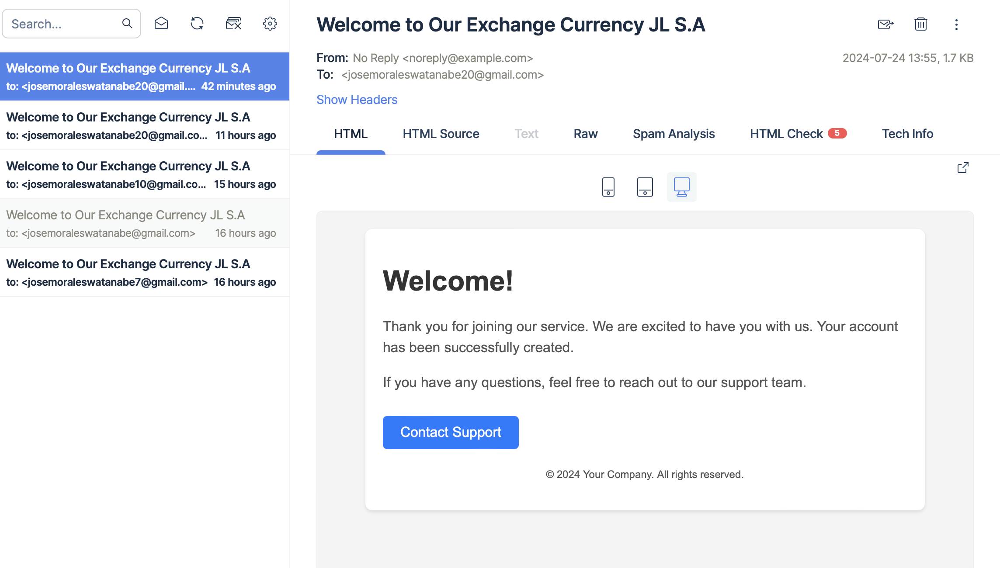

<p align="center">
  <a href="http://nestjs.com/" target="blank"></a>
</p>

[circleci-image]: https://img.shields.io/circleci/build/github/nestjs/nest/master?token=abc123def456
[circleci-url]: https://circleci.com/gh/nestjs/nest

  <p align="center">A progressive <a href="http://nodejs.org" target="_blank">Node.js</a> framework for building efficient and scalable server-side applications.</p>
    <p align="center">
<a href="https://www.npmjs.com/~nestjscore" target="_blank"></a>
<a href="https://www.npmjs.com/~nestjscore" target="_blank"></a>
<a href="https://www.npmjs.com/~nestjscore" target="_blank"></a>
<a href="https://circleci.com/gh/nestjs/nest" target="_blank"></a>
<a href="https://coveralls.io/github/nestjs/nest?branch=master" target="_blank"></a>
<a href="https://discord.gg/G7Qnnhy" target="_blank"></a>
<a href="https://opencollective.com/nest#backer" target="_blank"></a>
<a href="https://opencollective.com/nest#sponsor" target="_blank"></a>
  <a href="https://paypal.me/kamilmysliwiec" target="_blank"></a>
    <a href="https://opencollective.com/nest#sponsor"  target="_blank"></a>
  <a href="https://twitter.com/nestframework" target="_blank"></a>
</p>
  <!--[](https://opencollective.com/nest#backer)
  [](https://opencollective.com/nest#sponsor)-->

## Descripción del proyecto

Esto es un demo de prueba para Prestamype


## Instalación

Considerar las siguientes variables de entorno al iniciar el docker-compose
- TOKEN_PROVIDER_EXPIRATION_PERIOD=7d// Tiempo de expiración del JWT
- PASSWORD_ENCRYPTION_ROUNDS=12
- TOKEN_PROVIDER_SECRET=spiderman// Secreto de JWT
- APP_PORT=3000// Puerto App
- EMAIL_HOST=sandbox.smtp.mailtrap.io// HOST DE SMTP 
- EMAIL_USERNAME=86ec9c2fa95a4e// EMAIL SMTP
- EMAIL_PASSWORD=f7a66e0e0dfe84// EMAIL PASSWORD SMTP
- CAMBIO_SEGURO_API_URL=https://api.test.cambioseguro.com/api/v1.1 // API CAMBIO SEGURO
- MONGO_URI="mongodb://mongo:27017/nestjs"//URI CONEXIÓN MONGODB

## Consideraciones
- Dado que es una demo el SMTP usado arriba 
no llega a enviar el email al destinario a su cuenta real. Todo se queda en el servidor del SMTP

- Cuando aparezcan estos logs significa que la applicación esta lista para uso 


## API Testing
Para testear los endpoints revisar los **.rest files**. Para correr estos archivos instalar la extension REST Client en VSCode

## Test

```bash
# unit tests
$ npm run test
```

## License

Nest is [MIT licensed](LICENSE).
